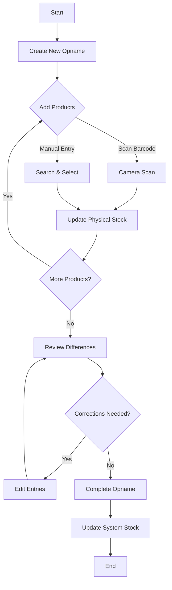

# Warehouse Management System - Stock Opname

Aplikasi mobile .NET MAUI untuk manajemen stock opname gudang dengan fitur barcode scanning.

[](https://dotnet.microsoft.com/apps/maui)
[](https://github.com/abcdels/learn-git-batch-4)
[](LICENSE)

## 📚 Documentation

- **[🚀 Quick Start Guide](QUICKSTART.md)** - Get started in 5 minutes!
- **[📖 Installation Guide](INSTALLATION.md)** - Detailed setup instructions
- **[🏗️ Architecture Documentation](WarehouseStockOpname/ARCHITECTURE.md)** - Technical deep-dive
- **[📊 Project Summary](PROJECT_SUMMARY.md)** - Complete feature overview

## 🚀 Fitur Utama

### 1. **Dashboard**
- Statistik real-time (Total Produk, Opname Aktif, Opname Selesai)
- Daftar semua stock opname
- Quick action: Buat opname baru dan lihat produk

### 2. **Stock Opname Management**
- Buat stock opname baru dengan nomor otomatis
- Track status: Draft, In Progress, Completed
- Detail informasi per opname (tanggal, penanggung jawab, notes)
- Summary total items dan selisih

### 3. **Barcode Scanning**
- Scan barcode produk menggunakan kamera
- Otomatis update physical stock
- Manual entry untuk barcode yang tidak terbaca
- Visual feedback untuk hasil scan

### 4. **Manual Stock Entry**
- Tambah produk manual tanpa scan
- Search produk berdasarkan SKU/nama
- Input physical stock dan notes
- Update existing entries

### 5. **Product Management**
- Daftar lengkap produk
- Search by SKU, nama, atau kategori
- Detail produk (lokasi, harga, stock)
- Data sample 10 produk untuk testing

### 6. **Stock Reconciliation**
- Bandingkan system stock vs physical stock
- Highlight perbedaan dengan color coding
- Update system stock setelah opname selesai
- Edit dan hapus item individual

## 📱 Teknologi

- **.NET MAUI 8.0** - Cross-platform framework
- **SQLite** - Local database
- **CommunityToolkit.MVVM** - MVVM pattern
- **ZXing.Net.Maui** - Barcode scanning
- **XAML** - UI design

## 🏗️ Arsitektur

```
WarehouseStockOpname/
├── Models/                      # Data models
│   ├── Product.cs
│   ├── StockOpname.cs
│   ├── StockOpnameDetail.cs
│   └── StockOpnameDetailViewModel.cs
├── ViewModels/                  # Business logic
│   ├── MainViewModel.cs
│   ├── StockOpnameDetailViewModel.cs
│   ├── ProductListViewModel.cs
│   ├── ScannerViewModel.cs
│   └── AddStockViewModel.cs
├── Views/                       # UI pages
│   ├── MainPage.xaml
│   ├── StockOpnameDetailPage.xaml
│   ├── ProductListPage.xaml
│   ├── ScannerPage.xaml
│   └── AddStockPage.xaml
├── Services/                    # Data services
│   └── DatabaseService.cs
├── Converters/                  # XAML converters
│   ├── StatusToColorConverter.cs
│   ├── IsNotNullConverter.cs
│   └── IsNotNullOrEmptyConverter.cs
└── Resources/                   # Assets & styles
    ├── Styles/
    │   ├── Colors.xaml
    │   └── Styles.xaml
    └── Images/
```

## 🗄️ Database Schema

### Products
- Id (PK)
- SKU (Unique)
- Name
- Description
- Category
- Unit
- Price
- SystemStock
- Location
- CreatedAt, UpdatedAt

### StockOpname
- Id (PK)
- OpnameNumber (Auto-generated: SO{yyyyMMdd}{seq})
- OpnameDate
- PerformedBy
- Status (Draft/InProgress/Completed)
- Notes
- CreatedAt, UpdatedAt

### StockOpnameDetail
- Id (PK)
- StockOpnameId (FK)
- ProductId (FK)
- SystemStock (snapshot)
- PhysicalStock
- Difference (calculated)
- Notes
- ScannedAt, ScannedBy

## 🎯 Workflow Stock Opname



## 💡 Cara Penggunaan

### Membuat Stock Opname Baru
1. Tap **"New Stock Opname"** di dashboard
2. Sistem generate nomor opname otomatis
3. Status default: Draft

### Scan Produk
1. Buka detail opname
2. Tap **"📷 Scan"**
3. Arahkan kamera ke barcode
4. Sistem otomatis tambah/update physical stock
5. Jika gagal scan, gunakan **"Manual Entry"**

### Entry Manual
1. Tap **"➕ Add Manual"**
2. Search produk berdasarkan SKU/nama
3. Pilih produk dari list
4. Input physical stock count
5. Tambahkan notes (opsional)
6. Tap **"Save"**

### Edit/Hapus Item
- Tap icon **✏️** untuk edit physical stock
- Tap icon **🗑️** untuk hapus item dari opname

### Menyelesaikan Opname
1. Review semua items dan differences
2. Tap **"✓ Complete"**
3. Konfirmasi untuk update system stock
4. Status berubah ke Completed
5. System stock diupdate sesuai physical stock

## 🎨 UI Features

### Color Coding
- **Draft**: Orange (#FFA500)
- **In Progress**: Blue (#0066CC)
- **Completed**: Green (#008000)
- **Positive Difference**: Green
- **Negative Difference**: Red
- **No Difference**: Gray

### Statistics Cards
- Blue card: Total Products
- Orange card: Active Opnames
- Green card: Completed Opnames

### Product List
- Category badge (Blue)
- Location badge (Orange)
- Stock count display
- Search functionality

## 📦 Sample Data

Aplikasi include 10 sample products:
- **Electronics**: Laptop, Mouse, Keyboard, Monitor, Headset, Webcam
- **Accessories**: USB Hub, HDMI Cable, Power Bank
- **Storage**: External SSD

Lokasi: A-01-01 s/d B-02-02

## 🔐 Permissions

### Android
- `CAMERA` - Untuk barcode scanning
- `INTERNET` - Future features
- `ACCESS_NETWORK_STATE` - Network status

## 🚀 Build & Run

### Prerequisites
- .NET 8 SDK
- Visual Studio 2022 / VS Code with MAUI workload
- Android SDK (untuk Android)
- Xcode (untuk iOS/Mac)

### Build Commands
```bash
# Restore packages
dotnet restore WarehouseStockOpname/WarehouseStockOpname.csproj

# Build Android
dotnet build WarehouseStockOpname/WarehouseStockOpname.csproj -f net8.0-android

# Build iOS
dotnet build WarehouseStockOpname/WarehouseStockOpname.csproj -f net8.0-ios

# Run Android
dotnet run --project WarehouseStockOpname/WarehouseStockOpname.csproj -f net8.0-android
```

## 📝 Future Enhancements

- [ ] Export report ke PDF/Excel
- [ ] Multi-user dengan authentication
- [ ] Sync dengan server/cloud
- [ ] Print label barcode
- [ ] Stock history & analytics
- [ ] Low stock alerts
- [ ] Product image support
- [ ] Batch import/export
- [ ] Role-based access
- [ ] Approval workflow

## 🤝 Contributing

Silakan fork repository dan submit pull request untuk improvements.

## 📄 License

MIT License

## 👤 Author

**Development Team**

## 📞 Support

Untuk pertanyaan dan support, silakan buat issue di repository.

## 📚 Additional Resources

### Documentation
- [Quick Start Guide](QUICKSTART.md) - 5-minute tutorial
- [Installation Guide](INSTALLATION.md) - Complete setup
- [Architecture Docs](WarehouseStockOpname/ARCHITECTURE.md) - Technical details
- [Project Summary](PROJECT_SUMMARY.md) - Feature overview

### External Links
- [.NET MAUI Documentation](https://docs.microsoft.com/dotnet/maui/)
- [SQLite-net](https://github.com/praeclarum/sqlite-net)
- [CommunityToolkit.Mvvm](https://learn.microsoft.com/windows/communitytoolkit/mvvm/)
- [ZXing.Net.Maui](https://github.com/Redth/ZXing.Net.Maui)

## 🌟 Features Highlight

✅ **Complete MVVM** implementation with CommunityToolkit  
✅ **Barcode Scanning** via camera with ZXing  
✅ **SQLite Database** with auto-seeding  
✅ **Real-time Statistics** on dashboard  
✅ **Color-coded UI** for better UX  
✅ **Cross-platform** (Android, iOS, Windows)  
✅ **Production-ready** architecture  

---

**Made with ❤️ using .NET MAUI**
